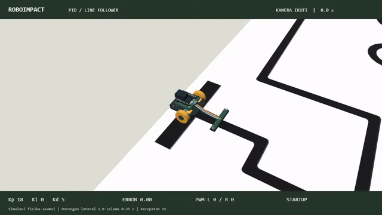
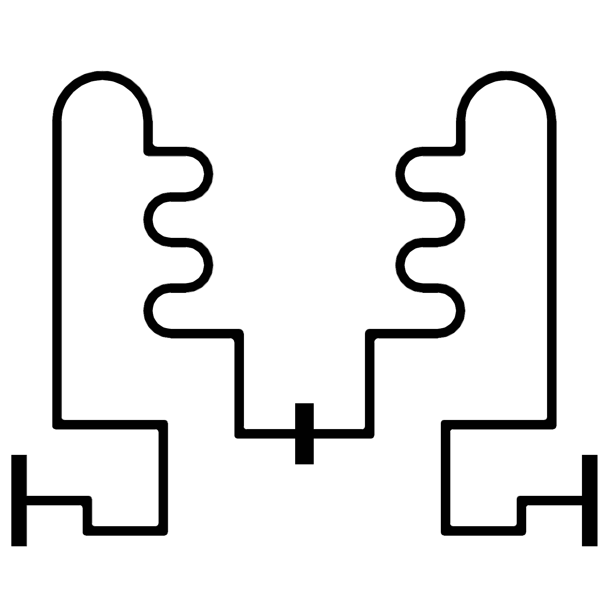

# ROBOIMPACT 2026 | LINE FOLLOWER

Program Arduino untuk robot line follower berbasis PID dengan manuver checkpoint dan parkir.

## Preview simulasi PID

Kamera Ikuti dengan tiga dorongan lateral untuk memperlihatkan koreksi PID hingga robot berhenti di finish. Video memakai fisika asumsi dan recovery khusus simulator, bukan pengujian robot fisik. [Cara menjalankan simulator](Animation/README.md).

## Track

Start dari garis panjang di kiri atau kanan, menuju finish pada balok hitam tengah.

## Sketch Arduino

| Sketch | Fungsi |
| --- | --- |
| `line_follower/line_follower.ino` | Program utama line follower, manuver checkpoint, dan parkir. |
| `line_follower_pid/line_follower_pid.ino` | Versi PID dan pencarian garis tanpa manuver misi (sebelumnya `line_follower1.ino`). |
| `test/motor_test/motor_test.ino` | Pengujian motor melalui driver L298N. |
| `test/sensor_test/sensor_test.ino` | Pembacaan sensor garis melalui Serial Monitor. |

## Penggunaan

1. Buka sketch di Arduino IDE dan pilih board serta port sesuai perangkat.
2. Periksa pemetaan pin dan kecepatan motor sebelum upload.
3. Serial Monitor tes sensor menggunakan 115200 baud; tes motor menggunakan 9600 baud.

## Pemetaan pin

| Sinyal | Program utama | Tes terkait |
| --- | --- | --- |
| Sensor | S1-S6: A0-A5 | S1-S5: A1-A5 |
| Motor kiri (IN1, IN2, ENA) | 10, 9, 11 | 8, 7, 6 |
| Motor kanan (IN3, IN4, ENB) | 8, 7, 6 | 10, 9, 11 |
