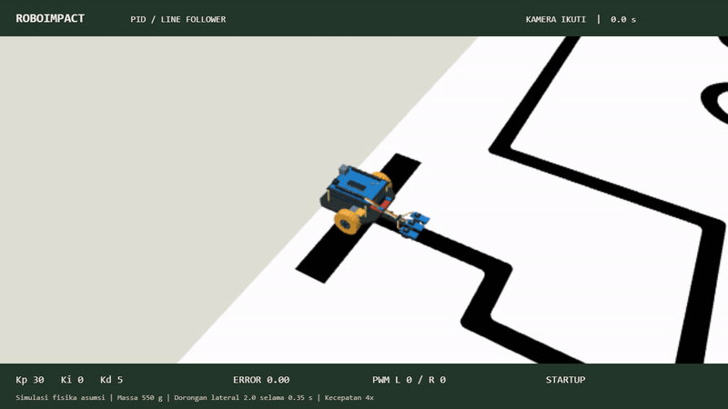
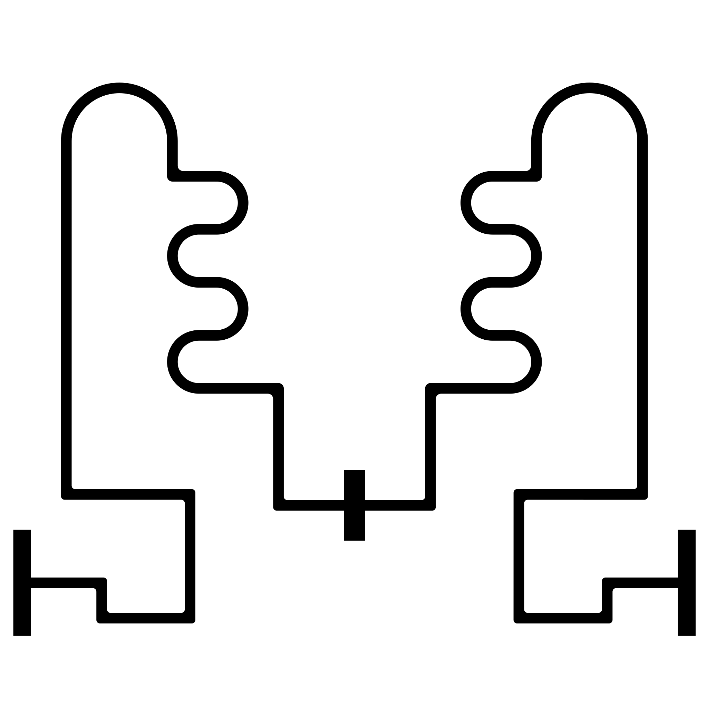

# ROBOIMPACT · Simulator line follower

Simulator 3D line follower dengan bang-bang tiga sensor sebagai default. PID tersedia sebagai pembanding; beri dorongan dan amati respons motor.

Robot kompak memakai tiga modul sensor IR biru terpisah (kiri A0, tengah A1, kanan A2) dan Arduino Uno di tray bertiang, dengan baterai rendah di tengah dan driver di depan axle. Ukuran Uno **68.6 × 53.4 mm** serta massa **25 g** mengikuti [spesifikasi Arduino](https://store.arduino.cc/products/arduino-uno-rev3). Dimensi chassis lainnya tetap perkiraan.

Deadzone motor memakai hysteresis: motor diam perlu PWM **≥60** untuk mulai, sedangkan motor yang sudah aktif dapat bertahan pada **≥45**. Di bawah ambang, target penggerak nol dan kecepatan tersisa meluruh melalui respons mekanik. Kurva kecepatan setelah aktif memakai `(PWM − 40) / (255 − 40)`. Ketiga angka merupakan asumsi awal untuk motor TT, bukan hasil kalibrasi. Kontrol memetakan demand positif di atas deadzone (minimum 60 PWM); demand nol tetap 0, sehingga berhenti dan belok satu roda tetap bekerja. Nilai dapat dikalibrasi di `src/motor.ts`.

Massa total awal **550 g** termasuk baterai, dapat diubah pada panel ROBOT dari **300–1200 g**. Massa memengaruhi percepatan motor, respons belok, perlambatan, dan percepatan akibat dorongan. Dua baterai dan holder diperkirakan 95 g; jalur kabel sensor dibundel mengikuti boom dengan dua klip. Respons mekanik default tetap pendekatan orde satu 120 ms.

Tuning tiga sensor memakai **Kp 30, Ki 0, Kd 5**, dengan pencarian garis berganti arah setiap **1.4 detik**. Uji perjalanan penuh dari kedua start pada arena 2 m, loop 10 ms, tanpa gangguan, berhasil untuk massa 300/600/900/1200 g. Pada 600 g, finish dengan deadzone tercapai sekitar 50–51 detik waktu simulasi; motor kemudian tetap berhenti sampai Reset. Gain Arduino tetap 18/0/5. Keberhasilan ini belum menjamin semua gain, skala arena, atau gangguan.

**TypeScript · Three.js · Vite**

[Mulai](#mulai) · [Kontrol](#kontrol) · [Track](#track) · [Logika robot](#logika-robot) · [Pengembangan](#pengembangan) · [Materi Arduino](../code/README.md)

## Preview

[](output/pid-follow-preview.mp4)

Kamera **Ikuti**, tiga dorongan lateral, lalu berhenti di finish. Ini hasil skenario simulasi yang direkam; model fisiknya belum dikalibrasi dengan robot asli.

## Mulai

Siapkan **Node.js 22.18+** dan browser dengan **WebGL 2**. Dari root repository:

```powershell
cd Simulator
npm ci
npm run dev
```

Buka [simulator lokal](http://127.0.0.1:8765). Arena langsung memenuhi viewport browser. Tekan **Keluar** untuk melihat panel pengaturan dan telemetri.

### Percobaan pertama

1. Pilih kamera **Ikuti**, lalu beri **Dorong kiri** atau **Dorong kanan**.
2. Keluar dari tampilan arena penuh, ubah satu gain, lalu tekan **Reset**.
3. Ulangi gangguan yang sama; bandingkan zig-zag dan waktu kembali ke garis.

Pelajari efek tiap gain lewat [infografik P–I–D](../code/README.md#panduan-pid).

## Kontrol

| Kontrol | Kegunaan |
| --- | --- |
| Jeda / Lanjut | Menghentikan sementara dan melanjutkan simulasi |
| Reset | Mengulang perjalanan dengan pengaturan saat ini |
| Dorong kiri / kanan | Pulsa lateral relatif terhadap arah robot |
| Perspektif / Atas / Samping / Ikuti | Mengubah sudut kamera |
| Fullscreen / Keluar | Memperbesar arena atau kembali ke panel lengkap |
| Kecepatan 0.5× / 1× / 2× | Mengubah kecepatan pemutaran |
| Kp, Ki, Kd | Mengubah kontribusi kontrol PID |
| Muat gain 3 sensor | Memulihkan gain 30/0/5 dan mengulang startup |
| Track, sisi arena, posisi start | Mengubah geometri pengujian dan mengulang perjalanan |
| Periode loop / Tukar sisi fisik motor | Mengubah timing atau mapping motor dan mengulang perjalanan |

Grafik menampilkan **error sensor**, **komponen PID**, atau **PWM motor**. Posisi X adalah koordinat arena, bukan error PID. Dorongan saat jeda baru dijalankan ketika simulasi dilanjutkan.

## Track



| Bagian | Aturan simulator |
| --- | --- |
| Start | Garis panjang kiri atau kanan, menghadap ke dalam arena |
| Finish | Balok hitam tengah; motor berhenti saat sensor depan mencapai zona ini |
| Ukuran arena | Default 2 × 2 m; dapat diubah melalui panel |
| Track alternatif | Garis lurus untuk membandingkan respons kontrol |

[SVG vektor](assets/track.svg) · [PDF sumber](public/Track.pdf) · [Provenance dan hash](assets/provenance.json)

Ukuran 2 m berasal dari skala halaman PDF pada cetak 100%; ukuran arena fisik belum dikonfirmasi. Track ditampilkan sebagai geometri vektor dari SVG, sehingga tepinya tajam saat zoom. Mask sensor 1600 × 1600 dibuat dari SVG yang sama.

## Logika robot

[Hasil uji kode Arduino repo](tests/REPO_SKETCH_RESULTS.md) memakai parameter dan logika sketch asli pada model fisika yang sama. Mode browser di bawah mempertahankan tuning serta recovery simulator.

Mode **bang-bang** mengubah ADC menjadi keputusan biner pada threshold 400: sensor kiri aktif sendiri atau bersama tengah menghentikan roda kiri; sensor kanan menghentikan roda kanan. Tengah saja, kiri+kanan, atau ketiganya aktif membuat robot maju. Demand tetap 55 dikompensasi menjadi PWM 86; roda yang dihentikan mendapat PWM 0. Gain PID tidak memengaruhi mode ini. Saat semua sensor kehilangan garis, recovery di bawah tetap berlaku. Stop finish memakai zona tengah track agar garis start atau pola semua sensor aktif tidak menghentikan robot terlalu awal.

Uji tanpa gangguan pada arena 2 m, loop 10 ms, dari kedua start dan massa 300–1.200 g mencapai finish dengan bang-bang dalam sekitar 57–62 detik simulasi. Ini hasil model, bukan jaminan robot fisik.

Pilih **PID** pada dropdown Algoritma untuk membuka gain dan grafik kontribusi P/I/D. Dasar kontrol PID berasal dari [sketch line follower PID](../code/line_follower_pid/line_follower_pid.ino). Simulator menjalankan adaptasi TypeScript untuk tiga sensor, bukan mengeksekusi sketch Arduino langsung. Sketch PID Arduino kini memakai tiga sensor A0–A2 dengan gain 18/0,01/5, threshold 300, dan PWM dasar 60. Simulator mempertahankan tuning 30/0/5, threshold 100, serta kompensasi deadzone; hasil simulasinya bukan hasil menjalankan sketch Arduino langsung.

| Bagian | Perilaku aktif |
| --- | --- |
| Startup | Motor diam selama 1 detik |
| Sensor | Tiga ADC; aktif ketika nilai > 100 |
| Error | Rata-rata berbobot posisi −2, 0, 2; bobot sinyal ADC − 100 |
| Gain awal | Kp = 30, Ki = 0, Kd = 5 (tuning simulator tiga sensor) |
| Integral | Akumulasi error per loop, dibatasi ±100 |
| Derivative | Selisih error antar-loop; tanpa faktor waktu atau filter |
| PWM saat tracking | Demand integer 55 ± output PID dibatasi 0–90, lalu kompensasi deadzone; PWM maju 86/86, maksimum 116 |

### Recovery lost-line

Recovery berikut merupakan tambahan simulator; **belum diterapkan ke sketch Arduino**.

| Waktu sejak garis hilang | Respons |
| --- | --- |
| 0–150 ms | Hapus kontribusi PID lama, maju pelan dengan PWM 65/65 (demand 30/30) |
| 150 ms–3 detik | Cari dengan PWM 86/0 atau 0/86 (demand 55/0 atau 0/55); arah berganti tiap 1400 ms |
| Mencapai 3 detik | Berhenti dengan PWM 0/0 sampai Reset |
| Garis ditemukan sebelum timeout | Kembali tracking; integral dimulai ulang dan derivative pertama nol |

Arah pencarian pertama mengikuti error terakhir di luar ±0.25; jika belum diketahui, mulai ke kanan. Deteksi finish juga tambahan simulator. Lihat [perilaku sketch asli](../code/README.md#lost-line) sebelum menerapkannya ke robot.

<details>
<summary><strong>Detail model · Dimensi, motor, sensor, dan waktu</strong></summary>

Semua ukuran dan respons mekanik berikut adalah asumsi sementara.

| Parameter | Nilai |
| --- | --- |
| Skala scene | 1 unit = 10 cm |
| Deck robot | 9.5 × 8.4 cm; tray Uno dan baterai di tengah |
| Diameter / lebar ban | 4 cm / 1.2 cm |
| Jarak pusat kedua roda | 9.6 cm |
| Sensor di depan axle | 9.5 cm |
| Offset lateral sensor | −18, 0, 18 mm |
| Motor | 200 RPM pada PWM 255; deadzone startup 60, sustain 45; kurva kecepatan offset PWM 40 |
| Massa total | 550 g, estimasi; panel 300–1200 g |
| Respons motor / belok | 120 ms pada massa awal; meningkat seiring massa / inersia yaw |
| Periode loop default | 10 ms; pilihan 1/5/10/20 ms |
| Integrasi gerak | 1/120 detik, dengan substep pada batas loop firmware |
| Dorongan | Pulsa 0.35 detik; default 0.36 N, rentang 0.06–0.72 N |
| Drag lateral | 1.5 N·s/m, asumsi; gaya konstan 0.048 N |

Anggaran massa: chassis/dudukan 120 g, dua baterai/holder 95 g, dua motor 90 g, dua roda 45 g, Uno 25 g, driver 30 g, sensor 35 g, kabel/fastener 110 g. Selain Uno, angka ini belum ditimbang. Posisi pemasangan dan ukuran tiap komponen menghasilkan estimasi pusat massa dan inersia yaw di `robot.ts`.

Dorongan memakai `a = F/m` dengan konversi SI ke scene. Respons motor dan belok memakai model orde satu; massa slider mengasumsikan distribusi beban tetap. Model belum dikalibrasi terhadap torsi motor, rugi L298N, gesekan ban, atau tegangan baterai, dan belum mensimulasikan tipping maupun deformasi chassis. Dimensi tinggi pusat massa dipakai untuk dokumentasi distribusi beban, bukan simulasi roll/pitch.

- Track SVG memakai mask piksel hitam dengan footprint sensor berbobot. Track lurus memakai respons ADC Gaussian.
- Gerak differential drive berasal dari selisih kecepatan roda. Dorongan mengikuti arah lateral robot; momentum disimpan dalam koordinat dunia.
- Playback speed tidak mengubah periode loop dalam waktu simulasi.
- Deadzone motor telah dimodelkan sebagai asumsi. Model belum mencakup penurunan tegangan driver, massa terkalibrasi, atau timing ADC dan Serial hardware.
- Perhitungan JavaScript bukan emulasi bit-exact float AVR. `delay(1)` pada sketch tidak menjamin loop total 1 ms.

**Mapping motor:** `setLeftMotor()` mengendalikan pin 8/7, PWM 6; `setRightMotor()` pin 10/9, PWM 11. Default simulator menganggap fungsi tersebut sesuai roda kiri/kanan. Toggle pertukaran sisi memodelkan wiring terbalik; polaritas kabel motor belum dimodelkan.

</details>

## Pengembangan

Jalankan dari folder `Simulator`:

| Perintah | Fungsi |
| --- | --- |
| `npm run dev` | Dev server pada port 8765 |
| `npm run typecheck` | Memeriksa tipe TypeScript |
| `npm test` | Menguji controller dan model |
| `npm run build` | Typecheck dan build ke `dist/` |
| `npm run preview` | Menyajikan hasil build pada port 8765; hentikan dev server dahulu |

```text
Simulator/
├── src/              # Controller, model fisika, robot 3D, dan UI
├── styles/           # Stylesheet halaman dan arena
├── tests/            # Pengujian controller dan model
├── tools/recording/  # Perekam preview dan penerima video lokal
├── assets/           # Track, mask sensor, provenance, dan GIF
├── public/           # PDF sumber
├── output/           # MP4 preview dan ekspor lokal
├── index.html        # Entry point aplikasi
└── package.json      # Dependensi dan perintah npm
```

| File utama | Tanggung jawab |
| --- | --- |
| [firmware.ts](src/firmware.ts) | Pembacaan sensor, bang-bang/PID, startup, dan recovery |
| [model.ts](src/model.ts) | Gerak, motor, gaya, dan penjadwalan controller |
| [track.ts](src/track.ts) | Geometri track, mask sensor, start, dan finish |
| [robot.ts](src/robot.ts) | Konstanta dimensi robot bersama |
| [scene.ts](src/scene.ts) | Tampilan Three.js dan kamera |
| [simulation.ts](src/simulation.ts) | Kontrol UI dan histori telemetri |

Tes memeriksa perilaku model dan beberapa konstanta sketch. Jika Arduino berubah, port tetap perlu ditinjau manual. Lulus tes bukan bukti keberhasilan pada robot fisik atau semua konfigurasi track.

<details>
<summary><strong>Alat tambahan · Rekam video preview</strong></summary>

Dengan dev server aktif, buka terminal lain di folder `Simulator` dan jalankan penerima video lokal:

```powershell
uv run --no-project python tools/recording/record-save.py
```

Buka [halaman perekam](http://127.0.0.1:8765/tools/recording/record-preview.html). Rekaman disimpan ke `output/pid-follow-preview.webm`; penerima menggunakan port 8766.

Skenario preview memakai kamera Ikuti dengan dorongan berkekuatan 2.0 pada detik simulasi 12, 22, dan 35, masing-masing 0.35 detik. Rekaman yang tersedia mencapai finish pada 44.69 detik.

MP4 preview disimpan di Git. Ekspor lokal lain di `output/` diabaikan oleh `.gitignore`; GIF README berada di `assets/`.

</details>
