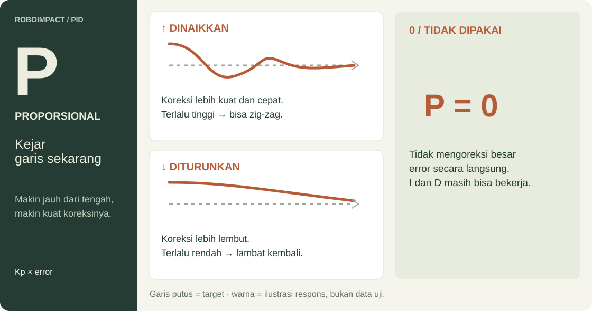
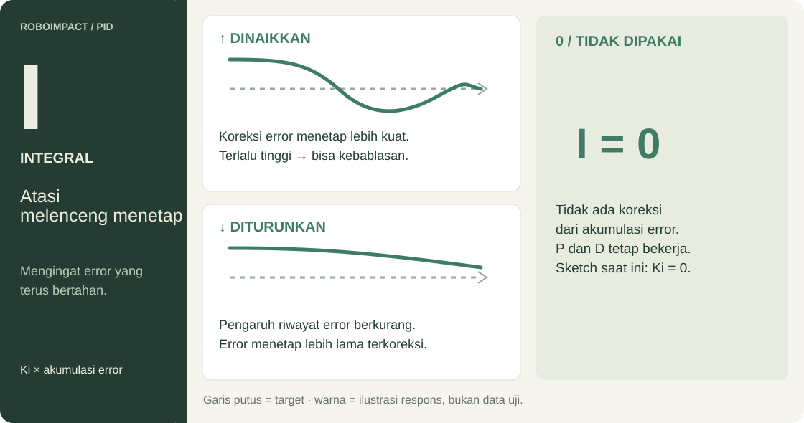
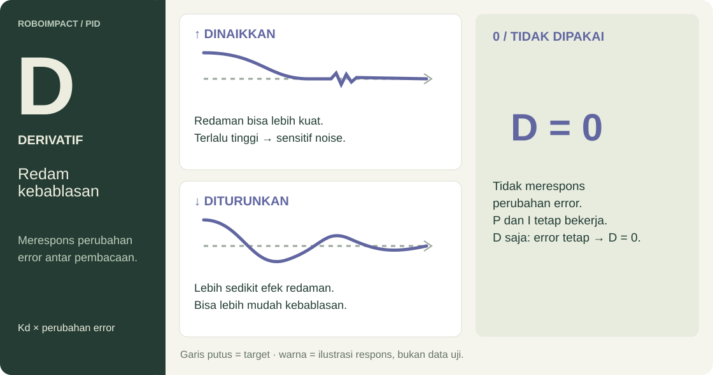

# ROBOIMPACT · Kode robot

Materi praktik robot line follower dua roda: **sensor → motor → PID → lost-line**.

[Mulai praktik](#mulai-praktik) · [Panduan PID](#panduan-pid) · [Wiring](#wiring) · [Lost-line](#lost-line) · [Simulator](../Simulator/README.md)

## Mulai praktik

Buka masing-masing sketch di Arduino IDE, pilih board dan port, lalu upload. Nama folder dan file `.ino` harus sama.

| Urutan | Sketch | Yang diperiksa | Serial Monitor |
| --- | --- | --- | --- |
| 1 · Sensor | [sensor_test.ino](test/sensor_test/sensor_test.ino) | Nilai sensor di putih dan hitam; tentukan threshold | 115200 baud |
| 2 · Motor | [motor_test.ino](test/motor_test/motor_test.ino) | Posisi roda dan arah putaran | 9600 baud |
| 3 · PID | [line_follower_pid.ino](line_follower_pid/line_follower_pid.ino) | Respons robot saat mengikuti garis | 115200 baud |

> **Sebelum menjalankan:** cocokkan [pin sensor](#sensor), karena kedua sketch memakai pin berbeda. Angkat roda saat tes motor pertama; sketch langsung menjalankan motor.

## Panduan PID

PID mengubah selisih kecepatan kedua motor agar garis kembali berada di tengah sensor.

| Gain awal | Kecepatan dasar | Batas PWM |
| --- | --- | --- |
| **Kp = 18 · Ki = 0 · Kd = 5** | 55 per motor | 0–90 pada skala 0–255 |

### P · Koreksi posisi sekarang



### I · Koreksi error yang menetap



### D · Respons perubahan error



### Percobaan tuning

1. Mulai dengan **P**, lalu tambahkan **D**. Gunakan **I** bila masih ada error kecil yang menetap.
2. Ubah **satu gain** tiap percobaan. Di simulator, tekan **Reset** dan beri gangguan yang sama.
3. Bandingkan **zig-zag**, **kebablasan**, dan **waktu kembali ke garis**.

Gambar menunjukkan ilustrasi respons, bukan data uji. Hasil bergantung pada gain lain dan kondisi robot.

> **Semua gain nol:** saat tracking, PWM menjadi 55/55 tanpa koreksi PID. Logika lost-line tetap bisa mengambil alih.

<details>
<summary><strong>Detail teknis · Rumus dan implementasi PID</strong></summary>

```text
Baca sensor → hitung error → hitung koreksi PID → atur PWM motor → ulangi
```

`readSensors()` menganggap sensor aktif jika ADC **lebih besar dari 100**. Bobot posisi S1–S5 adalah `[-10, -2, 0, 2, 10]`. Setiap sensor aktif menyumbang bobot sinyal `ADC - 100`:

```text
error = jumlah(posisi × bobot sinyal) / jumlah(bobot sinyal)
```

Targetnya `error = 0`, yaitu garis berada di tengah array sensor.

| Komponen | Peran | Implementasi sketch |
| --- | --- | --- |
| P | Mengoreksi error sekarang | `Kp × error` |
| I | Mengoreksi error yang terus bertahan | `Ki × integral`, dengan `integral += error`, dibatasi ±100 |
| D | Merespons perubahan error, dapat membantu mengurangi overshoot | `Kd × (error - lastError)` |

Gain awal: **Kp 18, Ki 0, Kd 5**. Karena Ki nol, kontribusi I tidak memengaruhi output, walaupun akumulatornya tetap diperbarui.

```text
pidOutput = P + I + D
PWM kiri  = constrain(int(55 + pidOutput), 0, 90)
PWM kanan = constrain(int(55 - pidOutput), 0, 90)
```

Contoh output `+20` menghasilkan PWM 75 dan 35. Arah belok fisiknya bergantung pada pemasangan motor dan urutan sensor. Angka PWM bukan RPM: batas 90 adalah perintah pada skala 0–255.

Integral dan derivative dihitung **per loop**, tanpa faktor waktu `dt`. `delay(1)` tidak menjamin periode loop tepat 1 ms karena pembacaan ADC dan keluaran Serial juga membutuhkan waktu.


</details>

## Wiring

### Sensor

| Sensor | Sketch PID | Tes sensor |
| --- | --- | --- |
| S1 | A0 | A1 |
| S2 | A1 | A2 |
| S3 | A2 | A3 |
| S4 | A3 | A4 |
| S5 | A4 | A5 |

Sesuaikan deklarasi pin dengan wiring sebelum berpindah sketch. Tes sensor menampilkan nilai analog setiap **300 ms**.

### Motor

| Fungsi | Pin arah | Pin PWM | Sketch |
| --- | --- | --- | --- |
| `setLeftMotor()` | 8, 7 | 6 | PID dan tes motor |
| `setRightMotor()` | 10, 9 | 11 | PID dan tes motor |

**Pastikan posisi roda lewat tes motor.** Tabel menunjukkan pin yang dikendalikan fungsi; penamaan kiri/kanan pada source belum konsisten.

<details>
<summary><strong>Detail teknis · Penamaan pin dan urutan tes motor</strong></summary>

Pada sketch PID, `setRightMotor()` memakai konstanta `motorL_*`, sedangkan `setLeftMotor()` memakai `motorR_*`. Komentar kiri/kanan pada tes motor juga tidak konsisten.

Loop tes motor mengulang urutan berikut:

| Tahap | Perintah | Durasi |
| --- | --- | --- |
| 1 | `setRightMotor(1,120)` dan `setLeftMotor(1,150)` | 2 detik |
| 2 | `turnLeft(100)` | 200 ms |
| 3 | `setRightMotor(1,120)` dan `setLeftMotor(1,150)` | 10 detik |

Tes maju/mundur lain masih dikomentari. `speedDefault = 200` tidak dipakai oleh loop aktif.

</details>

## Lost-line

Jika semua sensor tidak aktif, robot mempertahankan koreksi lama terlebih dahulu, lalu mencari garis menurut arah terakhir yang tersimpan.

| Kondisi | Perilaku sketch Arduino |
| --- | --- |
| Garis hilang | `lineDetected = false`, integral direset, error lama dipertahankan |
| Kurang dari 1 detik sejak garis terakhir terlihat | Gunakan output PID lama tanpa menghitung ulang PID |
| Mulai 1 detik; arah pencarian `1` | PWM 90/0 |
| Mulai 1 detik; arah pencarian `-1` | PWM 0/90 |
| Mulai 1 detik; arah pencarian masih `0` | Pertahankan perintah motor sebelumnya |

<details>
<summary><strong>Bahan diskusi · Batas logika lost-line</strong></summary>

- Arah pencarian hanya diperbarui saat error **> 5** atau **< −5**, sehingga arah tersimpan bisa kedaluwarsa.
- Jika arah masih nol, motor tidak menerima perintah baru; saat startup motor bisa tetap diam.
- Pencarian belum memiliki timeout.
- Derivative tidak direset saat garis ditemukan kembali.

</details>

## Arduino dan simulator

[Simulator TypeScript + Three.js](../Simulator/README.md) menggunakan dasar PID dari sketch ini, dengan beberapa tambahan:

| Fitur | Sketch Arduino | Simulator |
| --- | --- | --- |
| Line follower PID | Ada | Ada |
| Lost-line | Pencarian dasar di atas | Recovery tambahan |
| Berhenti di finish | Belum diimplementasikan | Berdasarkan zona arena |

Variabel `checkpointDetected`, `checkpointTime`, `pickup`, `drop`, dan `misi` masih dideklarasikan tetapi belum digunakan. **Robot fisik belum otomatis berhenti di penanda finish.**

---

Dokumentasi berdasarkan pembacaan source; belum merupakan hasil pengujian pada hardware tertentu.
