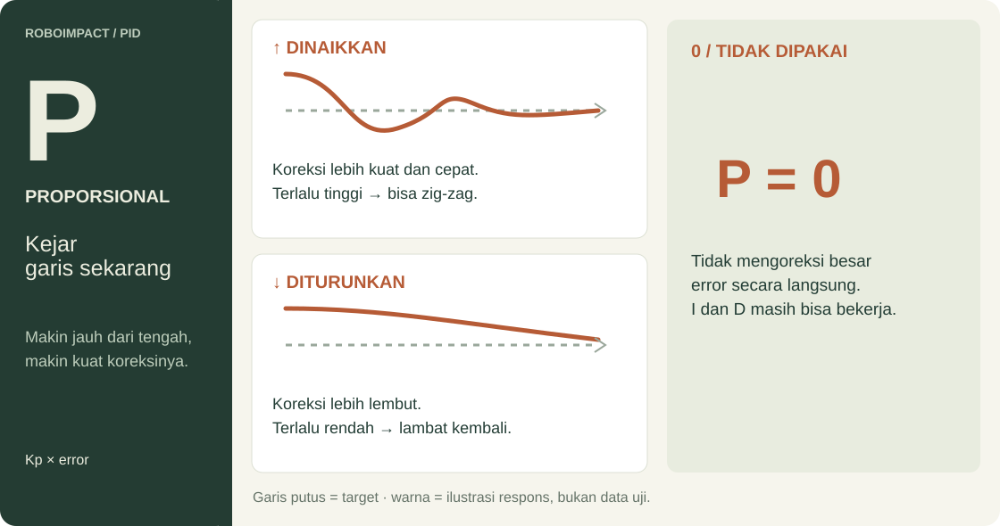
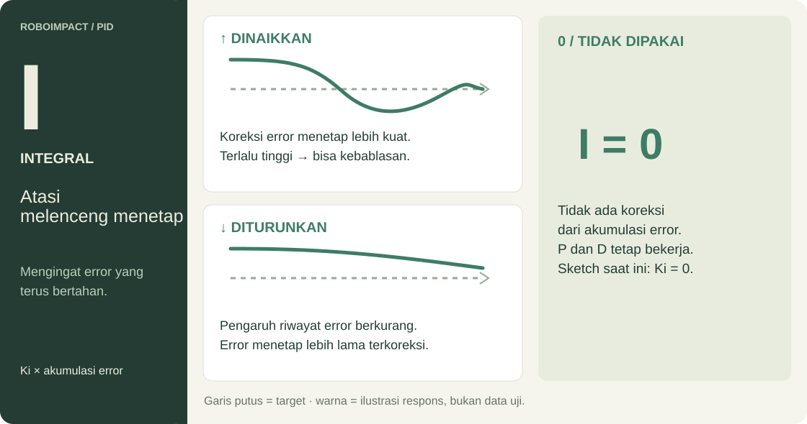
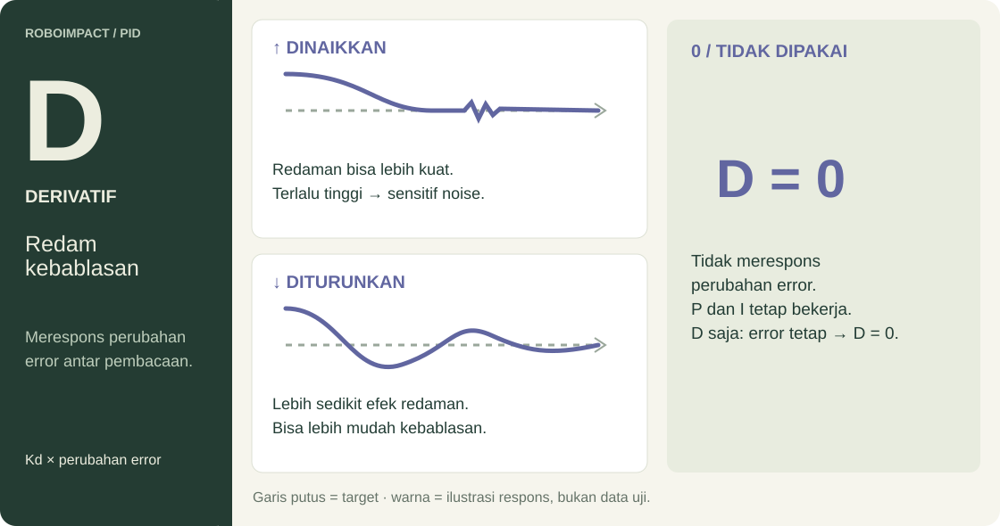

# ROBOIMPACT · Kode robot

Materi praktik robot line follower dua roda: **sensor → motor → bang-bang → PID → lost-line**.

[Mulai praktik](#mulai-praktik) · [Panduan bang-bang](line_follower_bang_bang/README.md) · [Panduan PID](#panduan-pid) · [Wiring](#wiring) · [Lost-line](#lost-line) · [Simulator](../Simulator/README.md)

## Mulai praktik

Buka masing-masing sketch di Arduino IDE, pilih board dan port, lalu upload. Nama folder dan file `.ino` harus sama.

| Urutan | Sketch | Yang diperiksa | Serial Monitor |
| --- | --- | --- | --- |
| 1 · Sensor | [sensor_test.ino](test/sensor_test/sensor_test.ino) | Nilai sensor di putih dan hitam; tentukan threshold | 115200 baud |
| 2 · Motor | [motor_test.ino](test/motor_test/motor_test.ino) | Posisi roda dan arah putaran | 9600 baud |
| 3 · Bang-bang | [line_follower_bang_bang.ino](line_follower_bang_bang/line_follower_bang_bang.ino) | Kontrol tiga sensor dengan threshold 400 | 9600 baud |
| 4 · PID | [line_follower_pid.ino](line_follower_pid/line_follower_pid.ino) | Respons robot saat mengikuti garis | 115200 baud |

> **Sebelum menjalankan:** cocokkan pin sensor dan motor dengan wiring. Sketch aktif memakai pemetaan yang sama; referensi lama memiliki pemetaan berbeda. Angkat roda saat tes motor pertama; sketch langsung menjalankan motor.

## Kontrol bang-bang

Sketch bang-bang memakai **kiri A0, tengah A1, kanan A2**, threshold **400**, dan PWM maju **86/86**. Motor kiri IN10/9–EN11, kanan IN8/7–EN6, sama dengan PID dan diagram hardware.

Sensor samping mengambil prioritas; pola simetris termasuk semua hitam tetap maju. Garis hilang memicu recovery lalu stop setelah 3 detik; Reset board untuk mencoba lagi. Tidak ada deteksi finish berdasarkan sensor saja. [Panduan lengkap](line_follower_bang_bang/README.md) memuat tabel keputusan dan tuning.

## Panduan PID

PID mengubah selisih kecepatan kedua motor agar garis kembali berada di tengah sensor.

| Gain awal | Kecepatan dasar | Batas PWM |
| --- | --- | --- |
| **Kp = 18 · Ki = 0,01 · Kd = 5** | 60 per motor | 0–85 pada skala 0–255 |

### P · Koreksi posisi sekarang



### I · Koreksi error yang menetap



### D · Respons perubahan error



### Percobaan tuning

1. Mulai dengan **P**, lalu tambahkan **D**. Gunakan **I** bila masih ada error kecil yang menetap.
2. Ubah **satu gain** tiap percobaan. Di simulator, tekan **Reset** dan beri gangguan yang sama.
3. Bandingkan **zig-zag**, **kebablasan**, dan **waktu kembali ke garis**.

Gambar menunjukkan ilustrasi respons, bukan data uji. Hasil bergantung pada gain lain dan kondisi robot.

> **Semua gain nol:** saat tracking, PWM menjadi 60/60 tanpa koreksi PID. Logika lost-line tetap bisa mengambil alih.

<details>
<summary><strong>Detail teknis · Rumus dan implementasi PID</strong></summary>

```text
Baca sensor → hitung error → hitung koreksi PID → atur PWM motor → ulangi
```

`readSensors()` menganggap sensor aktif jika ADC **lebih besar dari 300**. Sensor kiri/tengah/kanan memakai A0/A1/A2 dengan bobot `[-2, 0, 2]`. Setiap sensor aktif menyumbang bobot sinyal `ADC - 300`:

```text
error = jumlah(posisi × bobot sinyal) / jumlah(bobot sinyal)
```

Targetnya `error = 0`, yaitu garis berada di tengah array sensor.

| Komponen | Peran | Implementasi sketch |
| --- | --- | --- |
| P | Mengoreksi error sekarang | `Kp × error` |
| I | Mengoreksi error yang terus bertahan | `Ki × integral`, dengan `integral += error`, dibatasi ±100 |
| D | Merespons perubahan error, dapat membantu mengurangi overshoot | `Kd × (error - lastError)` |

Gain dari `pengmas.cpp`: **Kp 18, Ki 0,01, Kd 5**. Integral dibatasi ±100. Versi lima sensor sebelumnya disimpan di [code/reference](reference/README.md).

```text
pidOutput = P + I + D
PWM kiri  = constrain(int(60 + pidOutput), 0, 85)
PWM kanan = constrain(int(60 - pidOutput), 0, 85)
```

Contoh output `+20` menghasilkan PWM 80 dan 40. Arah belok fisiknya bergantung pada pemasangan motor dan urutan sensor. Angka PWM bukan RPM: batas 85 adalah perintah pada skala 0–255.

Integral dan derivative dihitung **per loop**, tanpa faktor waktu `dt`. `delay(1)` tidak menjamin periode loop tepat 1 ms karena pembacaan ADC dan keluaran Serial juga membutuhkan waktu.


</details>

## Wiring

[Diagram hardware umum](../hardware/README.md) memakai part Fritzing yang menyerupai Uno, L298N, sensor biru, dan motor TT. Rangkaian motor sama untuk bang-bang dan PID; tersedia versi tiga dan lima sensor.

### Sensor

| Sensor | Sketch PID | Tes sensor |
| --- | --- | --- |
| S1 · kiri | A0 | A0 |
| S2 · tengah | A1 | A1 |
| S3 · kanan | A2 | A2 |

Sesuaikan deklarasi pin dengan wiring sebelum berpindah sketch. Tes sensor menampilkan nilai analog setiap **300 ms**.

### Motor

| Fungsi | Pin arah | Pin PWM | Sketch |
| --- | --- | --- | --- |
| `setLeftMotor()` | 10, 9 | 11 | PID dan tes motor |
| `setRightMotor()` | 8, 7 | 6 | PID dan tes motor |

**Pastikan posisi roda lewat tes motor.** Pemetaan kini sama dengan deklarasi dan diagram hardware: kiri kanal A, kanan kanal B.

<details>
<summary><strong>Detail teknis · Penamaan pin dan urutan tes motor</strong></summary>

Pada sketch PID dan tes motor aktif, `setLeftMotor()` memakai `motorL_*`, sedangkan `setRightMotor()` memakai `motorR_*`. Versi lama dengan pemetaan berbeda disimpan di `code/reference`.

Loop tes motor mengulang urutan berikut:

| Tahap | Perintah | Durasi |
| --- | --- | --- |
| 1 | `setRightMotor(1,120)` dan `setLeftMotor(1,150)` | 2 detik |
| 2 | `turnLeft(100)` | 200 ms |
| 3 | `setRightMotor(1,120)` dan `setLeftMotor(1,150)` | 10 detik |

Tes maju/mundur lain masih dikomentari. `speedDefault = 200` tidak dipakai oleh loop aktif.

</details>

## Lost-line

Jika semua sensor tidak aktif, robot mempertahankan koreksi lama terlebih dahulu, lalu mencari garis menurut arah terakhir yang tersimpan.

| Kondisi | Perilaku sketch Arduino |
| --- | --- |
| Garis hilang | `lineDetected = false`, integral direset, error lama dipertahankan |
| Kurang dari 1 detik sejak garis terakhir terlihat | Gunakan output PID lama tanpa menghitung ulang PID |
| Mulai 1 detik; arah pencarian `1` | PWM 90/0 |
| Mulai 1 detik; arah pencarian `-1` | PWM 0/90 |
| Mulai 1 detik; arah pencarian masih `0` | Pertahankan perintah motor sebelumnya |

<details>
<summary><strong>Bahan diskusi · Batas logika lost-line</strong></summary>

- Arah pencarian hanya diperbarui saat error **> 0,25** atau **< −0,25**, sehingga arah tersimpan bisa kedaluwarsa.
- Jika arah masih nol, motor tidak menerima perintah baru; saat startup motor bisa tetap diam.
- Pencarian belum memiliki timeout.
- Derivative tidak direset saat garis ditemukan kembali.

</details>

## Arduino dan simulator

[Simulator TypeScript + Three.js](../Simulator/README.md) menggunakan dasar PID dari sketch ini, dengan beberapa tambahan:

| Fitur | Sketch Arduino | Simulator |
| --- | --- | --- |
| Line follower PID | Ada | Ada |
| Lost-line | Pencarian dasar di atas | Recovery tambahan |
| Berhenti di finish | Belum diimplementasikan | Berdasarkan zona arena |

Variabel `checkpointDetected`, `checkpointTime`, `pickup`, `drop`, dan `misi` masih dideklarasikan tetapi belum digunakan. **Robot fisik belum otomatis berhenti di penanda finish.**

---

Dokumentasi berdasarkan pembacaan source; belum merupakan hasil pengujian pada hardware tertentu.
