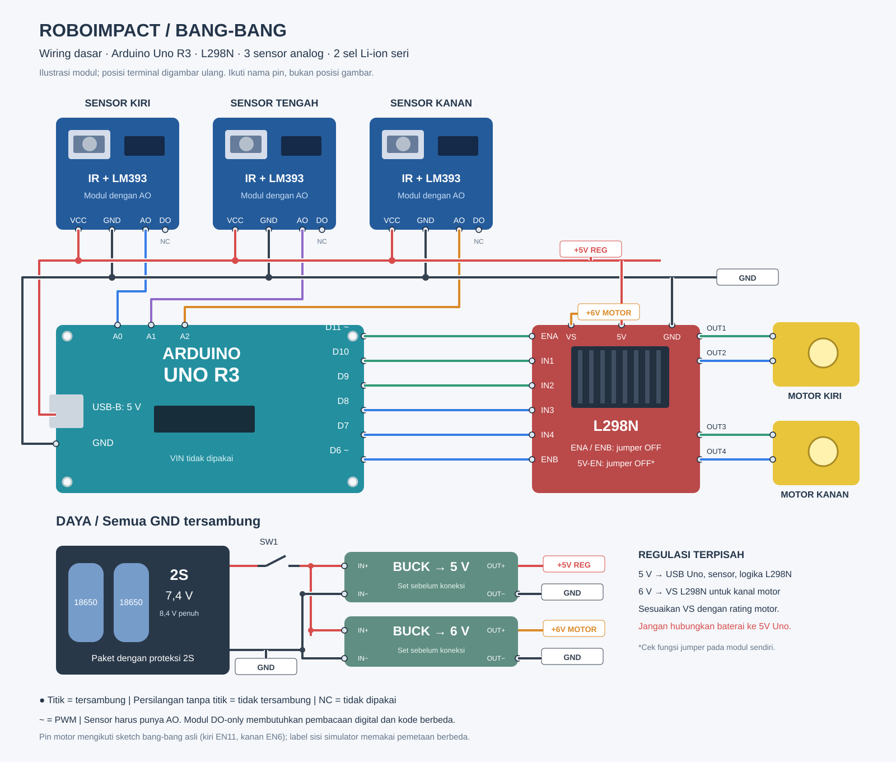

# Wiring dasar · Bang-bang tiga sensor

> **Versi sebelumnya.** Diagram yang diperbarui kini berada di [hardware umum](../../../hardware/README.md), dengan part Fritzing dan konfigurasi tiga/lima sensor untuk bang-bang maupun PID. File di folder ini dipertahankan sebagai versi awal.



[SVG tajam dan editable](wiring-3-sensor.svg) · [PNG 1600 × 1360](wiring-3-sensor.png) · [Panduan algoritma](../README.md)

Diagram ini menggunakan ilustrasi modul gaya breadboard/Fritzing. Ini bukan file proyek `.fzz` atau skematik native KiCad. Posisi pin pada gambar disederhanakan: **ikuti nama terminal pada modul asli**, karena urutan header sensor dan driver bisa berbeda.

## Komponen

- Arduino Uno R3.
- Driver modul L298N dengan terminal suplai motor dan logika 5 V.
- Dua motor gearbox TT; suplai motor pada diagram diasumsikan 6 V, sesuaikan rating motor yang dipakai.
- Tiga modul IR biru dengan keluaran **AO**; DO tidak digunakan.
- Paket dua sel Li-ion seri (2S), nominal 7,4 V dan 8,4 V saat penuh, dengan proteksi yang sesuai.
- Sakelar utama dan dua regulator step-down: satu 5 V untuk logika, satu 6 V untuk suplai driver motor.
- Adaptor/kabel power USB-B untuk Uno dan distribusi 5 V/GND.

Regulator ditambahkan pada rancangan ini; diagram bukan salinan wiring foto. Regulator motor harus mampu memasok arus kedua motor, termasuk saat mulai berputar. Diagram tidak mencakup rangkaian charger atau detail internal proteksi paket baterai.

## Sensor

| Modul | Sambungan |
| --- | --- |
| Kiri | AO → A0 Uno |
| Tengah | AO → A1 Uno |
| Kanan | AO → A2 Uno |
| Ketiga sensor | VCC → 5 V regulated; GND → ground bersama |
| DO | Tidak disambungkan |

Gunakan modul yang mendukung suplai 5 V dan keluaran AO dalam rentang input Uno. Modul biru yang hanya memiliki VCC, GND, dan DO tidak bisa mengikuti wiring analog ini tanpa perubahan kode. Threshold bang-bang simulator adalah ADC **> 400**; threshold robot fisik ditentukan dari pengukuran hitam/putih.

## Motor dan driver

| Arduino | Terminal L298N | Fungsi |
| --- | --- | --- |
| D11 (PWM) | ENA | Kecepatan roda kiri |
| D10 | IN1 | Arah kanal kiri |
| D9 | IN2 | Arah kanal kiri |
| D8 | IN3 | Arah kanal kanan |
| D7 | IN4 | Arah kanal kanan |
| D6 (PWM) | ENB | Kecepatan roda kanan |
| — | OUT1 / OUT2 | Dua kabel motor kiri |
| — | OUT3 / OUT4 | Dua kabel motor kanan |

Motor mengikuti pemetaan **sketch bang-bang asli**. Pada sketch PID dan label fungsi simulator, kiri/kanan dipetakan berbeda. Cocokkan posisi roda lewat tes motor; jangan menganggap label sisi pada kedua program sama.

Lepaskan jumper ENA/ENB untuk mengendalikan enable lewat PWM. Pada modul L298N umum, lepaskan jumper **5V-EN** sebelum memberi suplai 5 V eksternal ke terminal logika. Periksa petunjuk modul sendiri: fungsi jumper dan terminal 5 V tidak dijamin sama pada semua varian.

## Distribusi daya

```text
Paket 2S (+) → sakelar → IN+ buck 5 V dan IN+ buck 6 V
Paket 2S (−) → GND bersama

Buck 5 V OUT+ → power USB Uno + VCC sensor + logika 5 V L298N
Buck 6 V OUT+ → VS / terminal suplai motor L298N
Semua IN−, OUT−, GND sensor, GND driver, dan GND Uno → GND bersama
```

Label `+5V REG`, `+6V MOTOR`, dan `GND` yang berulang menunjukkan sambungan listrik yang sama. Persilangan kabel tanpa titik bukan sambungan.

Atur dan ukur keluaran regulator sebelum menyambungkan Uno/sensor. Uno pada rancangan ini menerima **5 V melalui USB**, bukan melalui VIN; baterai 2S tidak dihubungkan ke jalur 5 V. Untuk upload, cabut kabel power USB baterai dan gunakan USB komputer. Pilihan USB 5 V mengikuti [dokumentasi Arduino Uno](https://docs.arduino.cc/retired/boards/arduino-uno-rev3-with-long-pins/).

L298 memiliki suplai motor **VS** terpisah dari suplai logika **VSS**. Driver juga memiliki voltage drop, sehingga 6 V pada VS tidak menghasilkan 6 V penuh di motor; ini bisa mengurangi torsi dibanding driver modern. Rujukan: [datasheet L298 dari STMicroelectronics](https://www.st.com/resource/en/datasheet/l298.pdf). Terminal bertuliskan “12V” pada sebagian modul adalah input suplai motor, bukan kewajiban menggunakan 12 V; pastikan rentang kerja modul mendukung rancangan ini.

## Batas kecocokan dengan kode

Sketch bang-bang aktif sekarang memakai tiga sensor **A0/A1/A2**, sama dengan PID dan [diagram hardware umum](../../../hardware/README.md). Wiring tiga sensor bisa langsung digunakan dengan sketch aktif.

Versi dua sensor A3/A2 dipertahankan hanya sebagai [referensi lama](../../reference/line_follower_bang_bang_2_sensor/line_follower_bang_bang_2_sensor.ino).
