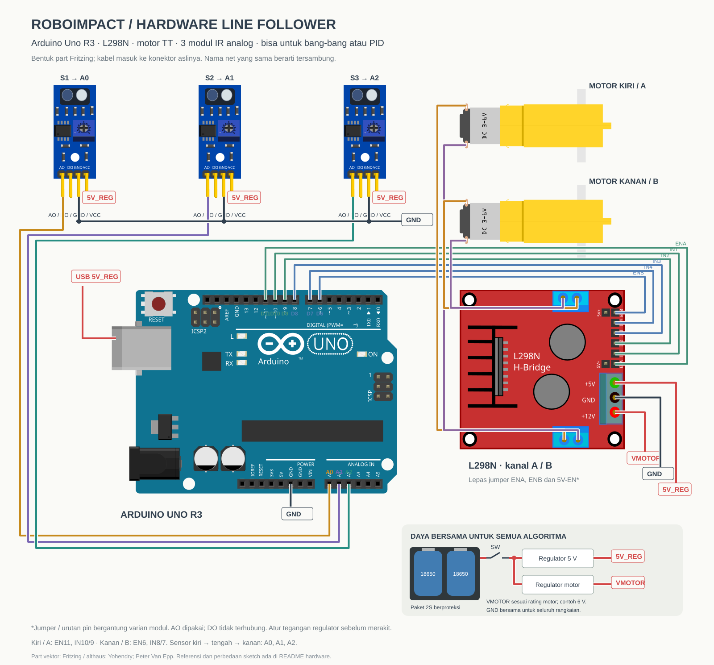
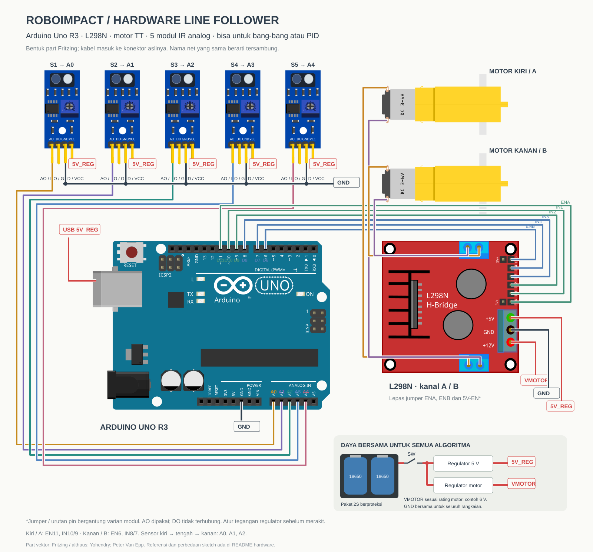

# Hardware umum · Robot line follower

Rangkaian Arduino Uno R3, driver L298N, dua motor TT, dan modul sensor IR analog bisa dipakai untuk **bang-bang maupun PID**. Algoritma mengubah cara menentukan PWM motor; pilihan algoritma tidak mengharuskan rangkaian motor atau suplai daya berbeda.

## Diagram wiring

### Tiga sensor · Sketch PID aktif dan simulator



[SVG editable](wiring-3-sensor.svg) · [PNG](wiring-3-sensor.png) · [Daftar sambungan CSV](connections-3-sensor.csv)

### Lima sensor · Referensi versi sebelumnya



[SVG editable](wiring-5-sensor.svg) · [PNG](wiring-5-sensor.png) · [Daftar sambungan CSV](connections-5-sensor.csv)

Diagram memakai **part breadboard Fritzing** untuk bentuk Uno, driver, motor kuning, dan modul sensor biru. Jalur kabel memakai koordinat konektor dari SVG part. Tampilan sensor diberi tambahan ilustrasi kepala optik; varian sensor pada foto belum teridentifikasi pasti. Cocokkan tulisan AO/DO/GND/VCC pada modul asli. Diagram bukan file native `.fzz` atau proyek KiCad, dan bukan replika skala dimensi robot.

## Sambungan motor yang sama

Pemetaan standar repo: **kanal A = motor kiri**, **kanal B = motor kanan**.

| Uno | L298N | Fungsi |
| --- | --- | --- |
| D11 PWM | ENA | Enable / PWM motor kiri (kanal A) |
| D10 | IN1 | Arah kanal A |
| D9 | IN2 | Arah kanal A |
| D8 | IN3 | Arah kanal B |
| D7 | IN4 | Arah kanal B |
| D6 PWM | ENB | Enable / PWM motor kanan (kanal B) |
| — | OUT1 / OUT2 | Kabel motor A |
| — | OUT3 / OUT4 | Kabel motor B |

Sketch PID aktif, sketch bang-bang, dan tes motor sekarang memakai kiri IN10/9–EN11 serta kanan IN8/7–EN6. `setLeftMotor()` PID mengendalikan kanal A, `setRightMotor()` kanal B. Periksa arah putaran saat roda diangkat; polaritas kabel motor masih menentukan arah fisik.

Lepaskan jumper ENA/ENB untuk PWM. Dalam rancangan suplai 5 V eksternal ini, jumper regulator **5V-EN** juga dilepas pada modul yang memang memakai jumper tersebut. Periksa varian modul sebelum memberi 5 V pada terminal logika; pada beberapa konfigurasi terminal itu menjadi keluaran regulator, bukan masukan.

## Jumlah dan pin sensor

| Konfigurasi | Susunan sensor dari kiri ke kanan | Kecocokan kode |
| --- | --- | --- |
| Tiga sensor | A0, A1, A2 | Sketch PID dan bang-bang aktif, serta kedua controller simulator |
| Lima sensor | A0, A1, A2, A3, A4 | [Sketch PID lama](../code/reference/line_follower_pid_5_sensor/line_follower_pid_5_sensor.ino) |
| Dua sensor asli | Kiri A3, kanan A2 | [Referensi bang-bang lama](../code/reference/line_follower_bang_bang_2_sensor/line_follower_bang_bang_2_sensor.ino) |

Masing-masing sensor: **AO → pin analog**, **VCC → 5V_REG**, dan **GND → ground bersama**. DO tidak disambungkan. Gunakan modul dengan AO dan suplai yang mendukung 5 V; modul tiga pin yang hanya punya DO memerlukan pembacaan digital dan perubahan kode.

Bang-bang dan PID sama-sama bisa ditulis untuk tiga atau lima sensor. Tabel di atas menjelaskan kode yang benar-benar tersedia sekarang, bukan batas jumlah sensor suatu algoritma.

## Daya

Panel daya merupakan rancangan distribusi suplai, bukan klaim bahwa foto robot sudah memiliki regulator tersebut.

- Dua sel Li-ion seri memakai paket berproteksi: nominal 7,4 V, hingga 8,4 V saat penuh.
- Sakelar memutus jalur positif paket menuju regulator.
- Regulator 5 V menghasilkan net **5V_REG**, untuk power USB Uno, VCC sensor, dan logika 5 V driver.
- Regulator motor menghasilkan **VMOTOR**, sesuai rating motor dan rentang suplai modul driver; contoh rancangan awal 6 V.
- Negatif baterai, IN−/OUT− regulator, GND sensor, GND driver, dan GND Uno terhubung pada **GND** yang sama.

Label net yang sama berarti sambungan listrik yang sama, walaupun kabel tidak digambar melintasi seluruh halaman. Persilangan kabel tanpa titik bukan sambungan. CSV mencantumkan koneksi ground pada panel daya yang diringkas secara visual.

Uno menerima 5 V melalui USB pada rancangan ini; VIN tidak digunakan. Atur regulator sebelum menyambungkan elektronik. Lepas power USB baterai saat menggunakan USB komputer untuk upload. Rujukan: [dokumentasi Arduino Uno](https://docs.arduino.cc/retired/boards/arduino-uno-rev3-with-long-pins/).

L298 memiliki suplai motor VS terpisah dari suplai logika VSS serta voltage drop pada kanal motor. VMOTOR bukan tegangan yang pasti sampai utuh pada motor. Terminal bertuliskan `+12V` pada part driver menunjukkan terminal suplai motor; pemilihan tegangan tetap mengikuti spesifikasi modul. Rujukan: [datasheet L298 dari STMicroelectronics](https://www.st.com/resource/en/datasheet/l298.pdf). Regulator motor harus sesuai arus kedua motor, termasuk saat start; charger dan rangkaian internal proteksi paket tidak digambar.

## Sumber part dan reproduksi

| Part | Sumber / atribusi |
| --- | --- |
| Uno R3 | [Fritzing parts library](https://github.com/fritzing/fritzing-parts/blob/develop/svg/core/breadboard/arduino_Uno_Rev3_breadboard.svg), metadata penulis althaus; lisensi pustaka disimpan di `parts/LICENSE-fritzing.txt` |
| L298N H-bridge | [Paket part coderfls](https://github.com/coderfls/Fritzing-Parts/blob/main/H-Bridge%20with%20L298N.fzpz), metadata penulis Yohendry |
| Motor TT | [Paket gear-motor](https://github.com/coderfls/Fritzing-Parts/blob/main/gear-motor.fzpz), metadata admin, dimodifikasi vanepp September 2019 |
| Modul sensor biru empat pin | [KY-033 oleh Peter Van Epp](https://forum.fritzing.org/t/looking-for-infrared-module-with-4-pins/17081/2); ditambahkan ilustrasi kepala optik pada komposisi |

SVG sumber dan metadata konektor disimpan dalam `parts/`. File referensi yang ditemukan selama pencarian juga dipertahankan; diagram akhir memakai Uno, L298N, gear-motor, dan KY-033. Aset pihak ketiga tetap mengikuti ketentuan dari sumber masing-masing.

Komposisi diagram SVG/PNG ini dibagikan dengan **Creative Commons Attribution-ShareAlike 3.0**, mengikuti lisensi grafis Fritzing. Atribusi: Fritzing dan para penulis part di tabel; komposisi dan routing untuk ROBOIMPACT.

[`generate.py`](generate.py) menghasilkan kedua SVG dan CSV tanpa dependensi Python tambahan:

```sh
python hardware/generate.py
```

PNG adalah ekspor untuk preview. Diagram diperiksa secara visual dan berdasarkan pemetaan pin source; belum merupakan hasil uji hardware atau pemeriksaan ERC KiCad.
